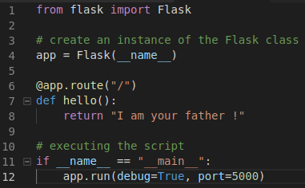
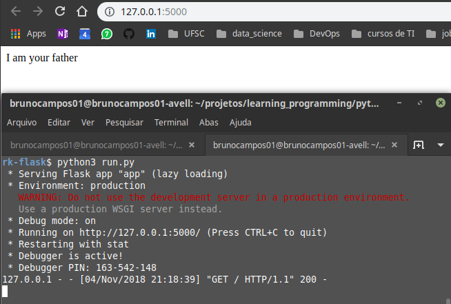
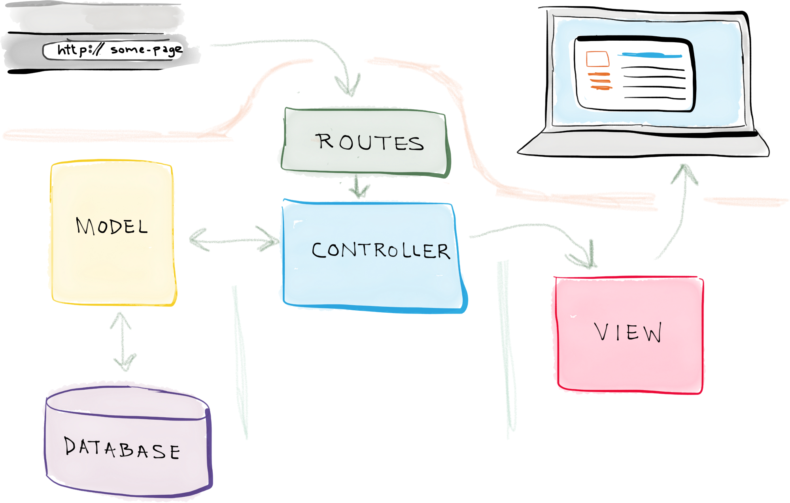

# Web Development
[](https://www.python.org/downloads/release/python-371/)


## Requisites
- Python 3.7
- Pip3
- requirements

# **Flask**


É um microframework feito para **simplificar o desenvolvimento web**.<br/>
Ele é micro pois trás somente módulos básico para executar uma aplicação web.
- Site oficial: http://flask.pocoo.org/
- Documentação: http://flask.pocoo.org/docs/1.0/

## Hello Word
- Arquivo sem padrão de projeto, bem simples.<br/>


## Special Function
- `__init__ ` é um construtor de objetos.
- ` @app.route("/")` é uma função do Python para indicar a rota

## Running in to Terminal


## Design Pattenrs
O Flask usa o padrão MVC.


## Create Environment
Para organizar, é necessário criar um diretório chamado  *app* com a eguinte estrutura:
```
app/
    controllers/
    models/
    static/
    templates/
```

- Para o Flask, o *view* são 2 diretórios: static e templates.

### Files .py
``` 
run.py
 run.py
 app/
    __init__.py
    controllers/
      __init__.py
      default.py
    models/
      __init__.py
      tables.py
    static/
    templates/
```
    
## Describe File
- `run.py` execução.
- `__init__.py` declaração da aplicação.
- `defaults.py` routes

---

#### Author
- Bruno Aurélio Rôzza de Moura Campos (brunocampos01@gmail.com)
#### Copyright
<a rel="license" href="http://creativecommons.org/licenses/by-sa/4.0/"></a><br />This work by <span xmlns:cc="http://creativecommons.org/ns#" property="cc:attributionName">Bruno A. R. M. Campos</span> is licensed under a <a rel="license" href="http://creativecommons.org/licenses/by-sa/4.0/">Creative Commons Attribution-ShareAlike 4.0 International License</a>.
